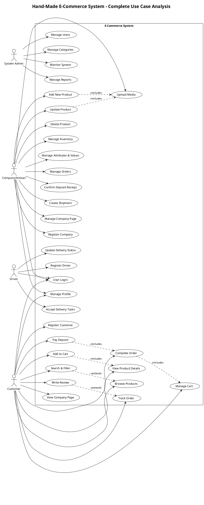
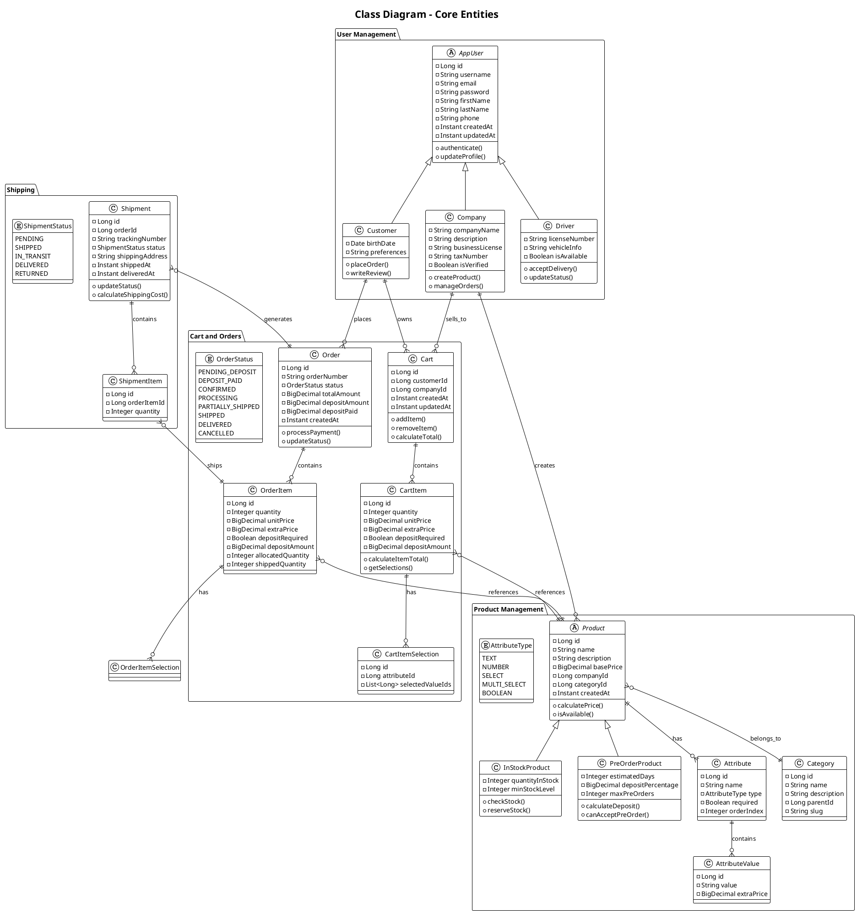
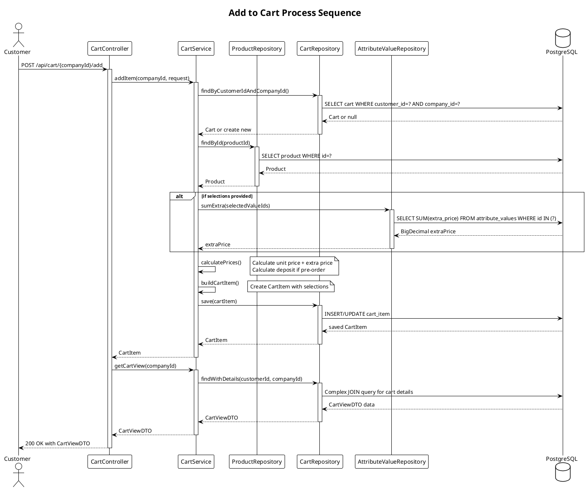
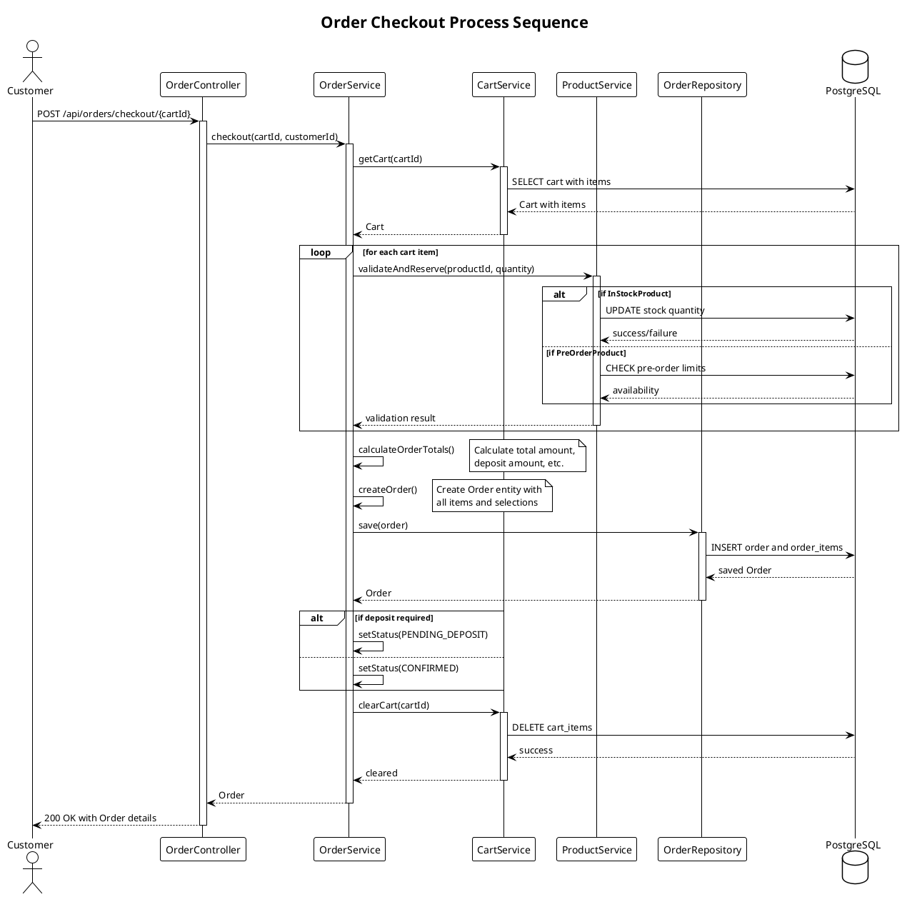
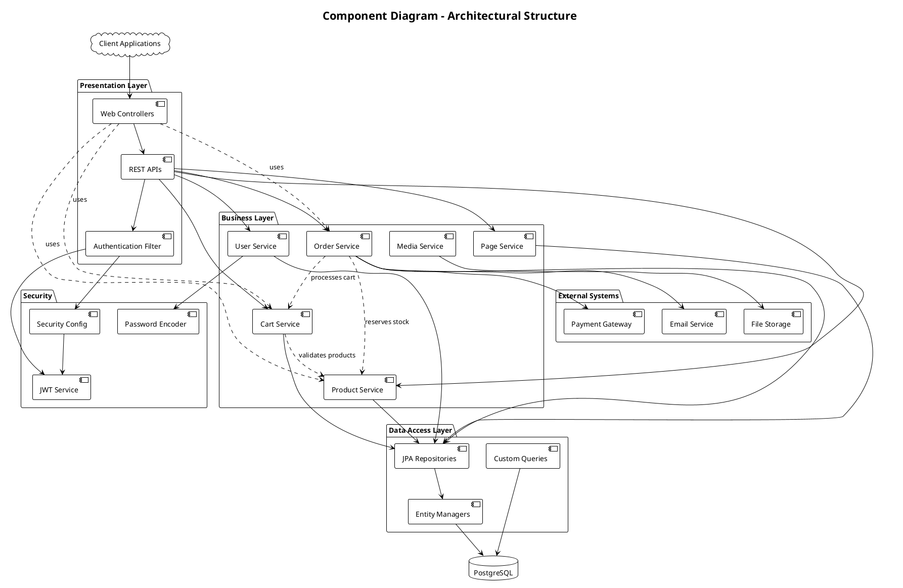
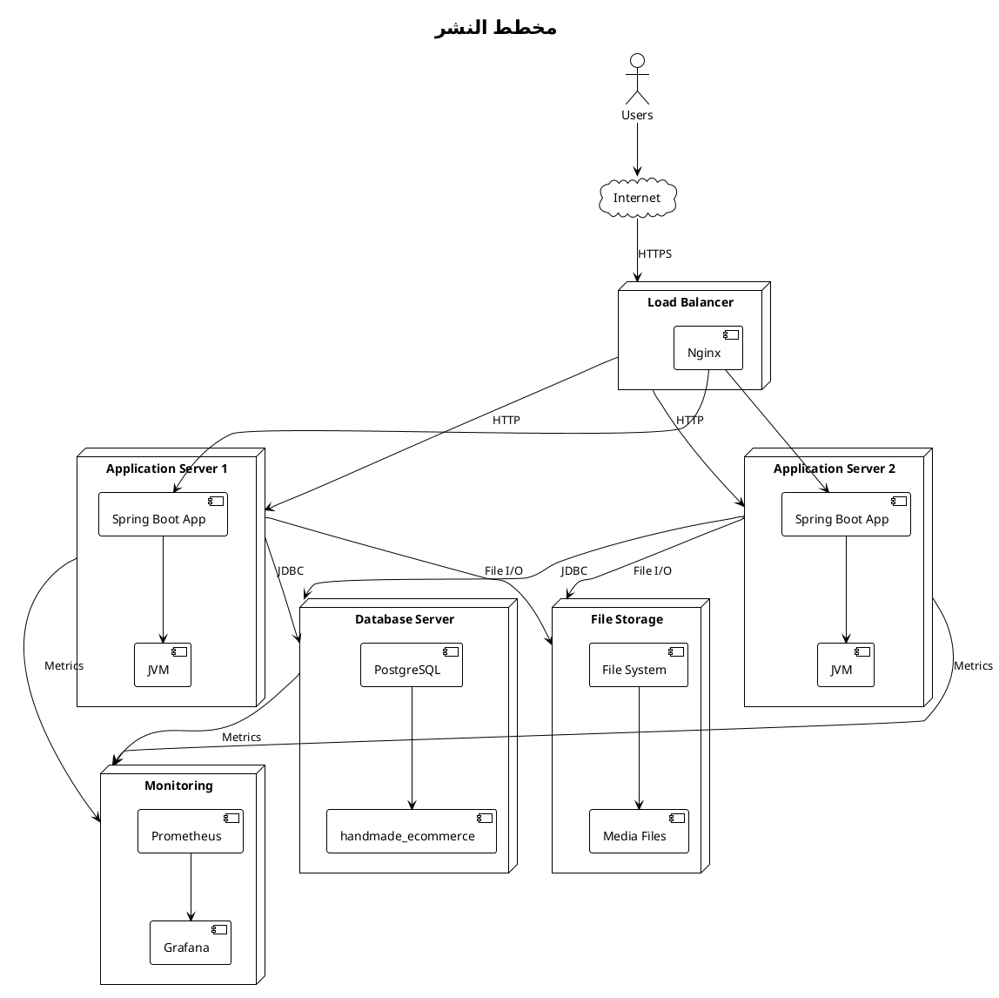

# Chapter 3: System Design and Architecture - UML Diagrams

## 3.1 System Design Overview

This chapter presents the comprehensive system design through various UML diagrams that illustrate the structure, behavior, and interactions within the Hand-Made E-Commerce System. The diagrams follow UML 2.5 standards and provide detailed insights into the system architecture.

## 3.2 Use Case Diagram

### 3.2.1 System Actors and Use Cases

## 2. Class Diagram - Core Entities

## 3. Sequence Diagram - Add to Cart Process

## 4. Sequence Diagram - Order Checkout Process

## 5. Component Diagram

## 6. Entity Relationship Diagram

```plantuml
@startuml
!theme plain
title مخطط علاقات قاعدة البيانات

entity "app_users" as users {
  * id : BIGINT <<PK>>
  --
  * username : VARCHAR(255) <<UK>>
  * email : VARCHAR(255) <<UK>>
  * password : VARCHAR(255)
  * first_name : VARCHAR(255)
  * last_name : VARCHAR(255)
  phone : VARCHAR(20)
  * created_at : TIMESTAMP
  updated_at : TIMESTAMP
  * user_type : VARCHAR(50)
}

entity "companies" as companies {
  * id : BIGINT <<PK,FK>>
  --
  * company_name : VARCHAR(255)
  description : TEXT
  business_license : VARCHAR(255)
  tax_number : VARCHAR(255)
  is_verified : BOOLEAN
}

entity "customers" as customers {
  * id : BIGINT <<PK,FK>>
  --
  birth_date : DATE
  preferences : TEXT
}

entity "categories" as categories {
  * id : BIGINT <<PK>>
  --
  * name : VARCHAR(255)
  description : TEXT
  parent_id : BIGINT <<FK>>
  * slug : VARCHAR(255) <<UK>>
  order_index : INTEGER
}

entity "products" as products {
  * id : BIGINT <<PK>>
  --
  * company_id : BIGINT <<FK>>
  * name : VARCHAR(255)
  description : TEXT
  * base_price : DECIMAL(10,2)
  category_id : BIGINT <<FK>>
  * product_type : VARCHAR(50)
  * created_at : TIMESTAMP
  updated_at : TIMESTAMP
}

entity "in_stock_products" as in_stock {
  * id : BIGINT <<PK,FK>>
  --
  * quantity_in_stock : INTEGER
  min_stock_level : INTEGER
}

entity "pre_order_products" as pre_order {
  * id : BIGINT <<PK,FK>>
  --
  estimated_days : INTEGER
  deposit_percentage : DECIMAL(5,2)
  max_pre_orders : INTEGER
}

entity "attributes" as attributes {
  * id : BIGINT <<PK>>
  --
  * product_id : BIGINT <<FK>>
  * name : VARCHAR(255)
  * type : VARCHAR(50)
  * required : BOOLEAN
  order_index : INTEGER
}

entity "attribute_values" as attr_values {
  * id : BIGINT <<PK>>
  --
  * attribute_id : BIGINT <<FK>>
  * value : VARCHAR(255)
  extra_price : DECIMAL(10,2)
}

entity "carts" as carts {
  * id : BIGINT <<PK>>
  --
  * customer_id : BIGINT <<FK>>
  * company_id : BIGINT <<FK>>
  * created_at : TIMESTAMP
  updated_at : TIMESTAMP
}

entity "cart_items" as cart_items {
  * id : BIGINT <<PK>>
  --
  * cart_id : BIGINT <<FK>>
  * product_id : BIGINT <<FK>>
  * quantity : INTEGER
  * unit_price : DECIMAL(10,2)
  extra_price : DECIMAL(10,2)
  deposit_required : BOOLEAN
  deposit_amount : DECIMAL(10,2)
  * created_at : TIMESTAMP
}

entity "cart_item_selections" as cart_selections {
  * id : BIGINT <<PK>>
  --
  * cart_item_id : BIGINT <<FK>>
  * attribute_id : BIGINT <<FK>>
  selected_value_ids : JSONB
}

entity "orders" as orders {
  * id : BIGINT <<PK>>
  --
  * customer_id : BIGINT <<FK>>
  * company_id : BIGINT <<FK>>
  * order_number : VARCHAR(50) <<UK>>
  * status : VARCHAR(50)
  * total_amount : DECIMAL(10,2)
  deposit_amount : DECIMAL(10,2)
  deposit_paid : DECIMAL(10,2)
  * created_at : TIMESTAMP
  updated_at : TIMESTAMP
}

entity "order_items" as order_items {
  * id : BIGINT <<PK>>
  --
  * order_id : BIGINT <<FK>>
  * product_id : BIGINT <<FK>>
  * quantity : INTEGER
  * unit_price : DECIMAL(10,2)
  extra_price : DECIMAL(10,2)
  deposit_required : BOOLEAN
  deposit_amount : DECIMAL(10,2)
  allocated_quantity : INTEGER
  shipped_quantity : INTEGER
}

entity "shipments" as shipments {
  * id : BIGINT <<PK>>
  --
  * order_id : BIGINT <<FK>>
  tracking_number : VARCHAR(255)
  * status : VARCHAR(50)
  shipping_address : TEXT
  shipped_at : TIMESTAMP
  delivered_at : TIMESTAMP
}

entity "shipment_items" as shipment_items {
  * id : BIGINT <<PK>>
  --
  * shipment_id : BIGINT <<FK>>
  * order_item_id : BIGINT <<FK>>
  * quantity : INTEGER
}

' Relationships
users ||--o{ companies : extends
users ||--o{ customers : extends

companies ||--o{ products : owns
categories ||--o{ products : categorizes
categories ||--o{ categories : parent/child

products ||--o{ in_stock : specializes
products ||--o{ pre_order : specializes

products ||--o{ attributes : has
attributes ||--o{ attr_values : contains

customers ||--o{ carts : owns
companies ||--o{ carts : sells_to
carts ||--o{ cart_items : contains
cart_items }o--|| products : references
cart_items ||--o{ cart_selections : has

customers ||--o{ orders : places
companies ||--o{ orders : receives
orders ||--o{ order_items : contains
order_items }o--|| products : references

orders ||--o{ shipments : generates
shipments ||--o{ shipment_items : contains
shipment_items }o--|| order_items : ships

@enduml
```

## 7. Deployment Diagram

---

## ملاحظات للرسوم البيانية

### متطلبات العرض
لعرض هذه الرسوم البيانية، ستحتاج إلى:

1. **PlantUML Plugin** في IDE مثل VS Code أو IntelliJ
2. **Online PlantUML Editor** على الرابط: [http://www.plantuml.com/plantuml/uml/](http://www.plantuml.com/plantuml/uml/)
3. **PlantUML Desktop Application**

### تخصيص الرسوم
يمكن تخصيص الرسوم البيانية من خلال:
- تغيير الألوان والثيمات
- إضافة تفاصيل أكثر للعمليات
- تقسيم الرسوم الكبيرة لأجزاء أصغر
- إضافة ملاحظات توضيحية

### التحديث المستمر
هذه الرسوم البيانية يجب تحديثها عند:
- إضافة ميزات جديدة
- تعديل البنية المعمارية
- تغيير في العلاقات بين الكيانات
- تطوير واجهات برمجة جديدة
